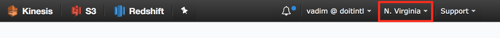

# Lab 1 - AWS Athena 사용해보기

>*이번 실습에서는 AWS Management Console을 사용하여 새 데이터베이스 및 테이블을 만들고 Athena를 이용하여 쿼리를 실행합니다. 추가로 MySQLWorkbench를 사용하여 생성한 테이블에 연결하고 AWS QuickSight를 사용하여 데이터를 시각화하는 법을 수행합니다.*
>
>**^^^AWS console을 US-East Region (N.Virginia)로 설정해주세요.^^^**



## CSV Parquet ORC 자료를 개인 S3 Bucket으로 복사

```bash
#!/bin/bash
# us-east-1 amazonlinux-minimal
# ami-c38a1bd5

# Update Image
sudo yum update -y && \
sudo yum install -y aws-cli

# Set environment variable
# Example
#export S3_TARGET="awskrug-athena"
export S3_TARGET="<YOUR_S3_BUCKET_NAME>"


# AWS CLI environment
export AWS_ACCESS_KEY_ID="<YOUR_ACCESS_KEY>"
export AWS_SECRET_ACCESS_KEY="<YOUR_SECRET_KEY>"

# AWSKRUG Athena Lab Bucket
export S3_INPUT="awskrug-athena-workshop"

aws s3 mb s3://${S3_TARGET}
aws s3 cp s3://${S3_INPUT}/labs/csv/ s3://${S3_TARGET}/csv/ --recursive
aws s3 cp s3://${S3_INPUT}/labs/orc/ s3://${S3_TARGET}/orc/ --recursive
aws s3 cp s3://${S3_INPUT}/labs/parquet/ s3://${S3_TARGET}/parquet/ --recursive

# Ready
# 
```

## Database 및 Table 생성

- [AWS Management Console Console](https://console.aws.amazon.com/console/home) 을 열고 'Athena' 서비스 선택
- *awskrug* 의 이름으로 **DATABASE** 생성
- `Query Editor` 에 아래 DDL Query 구문을 복사 후 `Run Query` 클릭

```sql
CREATE DATABASE IF NOT EXISTS awskrug
```

- 다음은 csv 파일로 부터 *yellow_trips_csv* **EXTERNAL TABLE** 생성하기
- `Query Editor` 에 아래 DDL query 구문을 복사 후 `Run Query` 클릭

> *<YOUR_S3_BUCKET_NAME>* 을 수정하세요

```sql
CREATE EXTERNAL TABLE IF NOT EXISTS awskrug.yellow_trips_csv(
         pickup_timestamp BIGINT,
         dropoff_timestamp BIGINT,
         vendor_id STRING,
         pickup_datetime TIMESTAMP,
         dropoff_datetime TIMESTAMP,
         pickup_longitude FLOAT,
         pickup_latitude FLOAT,
         dropoff_longitude FLOAT,
         dropoff_latitude FLOAT,
         rate_code STRING,
         passenger_count INT,
         trip_distance FLOAT,
         payment_type STRING,
         fare_amount FLOAT,
         extra FLOAT,
         mta_tax FLOAT,
         imp_surcharge FLOAT,
         tip_amount FLOAT,
         tolls_amount FLOAT,
         total_amount FLOAT,
         store_and_fwd_flag STRING
) ROW FORMAT DELIMITED FIELDS TERMINATED BY ','
  LOCATION 's3://<YOUR_S3_BUCKET_NAME>/csv/'
```

- 'Athena' 서비스에서 상단의 탭의 'Catalog Manager'를 선택후
 생성한 `awskrug` Database 와 `yellow_trips_csv` Table 확인
- Query 명령을 내릴 준비가 되었습니다.
- 아래 Query를 'Athena'의 `Query Box` 에 붙여 넣은뒤 `Format Query` 를 클릭
- `Click Run Query` 클릭
- **Run time** 시간값과 **Data scanned** 값을 기억해 두시기 바랍니다.

```sql
SELECT
from_unixtime(yellow_trips_csv.pickup_timestamp)
as pickup_date,
from_unixtime(yellow_trips_csv.dropoff_timestamp)
as dropoff_date,
*
FROM awskrug.yellow_trips_csv
LIMIT 100
```

## JDBC Driver를 사용하여 AWS Athena와 연동하기

> *JDBC Query 결과물을 저장할 S3 Bucket이 준비되어 있어야 합니다.*
>
> *SQL Workbench는 GUI환경을 제공하지만 다양한 OS환경 (Windows, Linux, Mac)에서의 실습의 진행의 어려움으로 인해 본 실습에서는 AWS의 EC2 Instance에서 SQL Workbench를 CLI Mode로 사용하여 진행합니다.*
>
> *SQL Workbench의 GUI를 사용하시려면 첨부 문서를 참조하시기 바랍니다.*

```bash
#!/bin/bash
# us-east-1 amazonlinux-minimal
# ami-c38a1bd5

# Update Image
sudo yum update -y && \
sudo yum install -y unzip make gcc-c++ aws-cli wget

# Install Java 8
# Download Java 8
wget --no-cookies --no-check-certificate --header "Cookie: gpw_e24=http%3A%2F%2Fwww.oracle.com%2F; oraclelicense=accept-securebackup-cookie" "http://download.oracle.com/otn-pub/java/jdk/8u131-b11/d54c1d3a095b4ff2b6607d096fa80163/jdk-8u131-linux-x64.tar.gz"

# Unpack JAVA
sudo tar xzf jdk-8u131-linux-x64.tar.gz -C /opt
sudo alternatives --install /usr/bin/java java /opt/jdk1.8.0_131/bin/java 2

# Install Java 8
sudo alternatives --install /usr/bin/jar jar /opt/jdk1.8.0_131/bin/jar 2
sudo alternatives --install /usr/bin/javac javac /opt/jdk1.8.0_131/bin/javac 2
sudo alternatives --set jar /opt/jdk1.8.0_131/bin/jar
sudo alternatives --set javac /opt/jdk1.8.0_131/bin/javac

# Set environment variables
export JAVA_HOME=/opt/jdk1.8.0_131
export JRE_HOME=/opt/jdk1.8.0_131/jre
export PATH=$PATH:/opt/jdk1.8.0_131/bin:/opt/jdk1.8.0_131/jre/bin

# Download Athena JDBC Driver
curl -LO "https://s3.amazonaws.com/athena-downloads/drivers/AthenaJDBC41-1.1.0.jar"

# Download SQL Workbench
curl -LO "http://www.sql-workbench.net/Workbench-Build122.zip"

# Unzip sqlworkbench.jar
unzip Workbench-Build122.zip sqlworkbench.jar

# Export environmet varibales
export DB_NAME="awskrug"
export S3_TARGET="<YOUR_S3_BUCKET>"


# Need to send KEY & SECRET
# Run SQL Workbench
java -jar sqlworkbench.jar -driver="com.amazonaws.athena.jdbc.AthenaDriver" -driverJar="./AthenaJDBC41-1.1.0.jar" -url="jdbc:awsathena://athena.us-east-1.amazonaws.com:443" -username="${AWS_ACCESS_KEY_ID}" -password="${AWS_SECRET_ACCESS_KEY}" -connectionProperties=s3_staging_dir="s3://${S3_TARGET}/jdbc-staging/"

# If you encouter ERROR Messages then try run and
# Select newly installed JAVA version
sudo alternatives --config java
# Every thing is set. Ready to execute SQL commands to AWS Athena remotely!!
```

- SQL Workbench콘솔에서 다음 쿼리를 실행

```sql
SELECT from_unixtime(yellow_trips_csv.pickup_timestamp) AS pickup_date,
         from_unixtime(yellow_trips_csv.dropoff_timestamp) AS dropoff_date,
         *
FROM awskrug.yellow_trips_csv LIMIT 100
```

> *JDBC를 이용하여 리모트에서 SQL 쿼리를 실행하였습니다.!*
>
> SQL Workbench 종료는 `\q` 를 입력하세요
>
> 인스턴스를 종료하지 마시고 다음 실습을 진행하시기 바랍니다.

## JDBC를 이용하여 NodeJS Application에서 AWS Athena와 연동하기

- [AWS Management Console Console](https://console.aws.amazon.com/console/home) 을 열고 'Athena' 서비스 선택
- `Query Editor` 에 아래 DDL Query 구문을 복사 후 `Run Query` 클릭

> *<YOUR_S3_BUCKET_NAME>* 을 수정하세요

```sql
CREATE EXTERNAL TABLE IF NOT EXISTS awskrug.yellow_trips_parquet(
         pickup_timestamp BIGINT,
         dropoff_timestamp BIGINT,
         vendor_id STRING,
         pickup_datetime TIMESTAMP,
         dropoff_datetime TIMESTAMP,
         pickup_longitude FLOAT,
         pickup_latitude FLOAT,
         dropoff_longitude FLOAT,
         dropoff_latitude FLOAT,
         rate_code STRING,
         passenger_count INT,
         trip_distance FLOAT,
         payment_type STRING,
         fare_amount FLOAT,
         extra FLOAT,
         mta_tax FLOAT,
         imp_surcharge FLOAT,
         tip_amount FLOAT,
         tolls_amount FLOAT,
         total_amount FLOAT,
         store_and_fwd_flag STRING
) STORED AS PARQUET
  LOCATION 's3://<YOUR_S3_BUCKET_NAME>/parquet/';
```

- EC2 인스턴스에서 아래 Bash를 실행

```bash
#!/bin/bash -e

# JAVA and JDBC is required. If not installed, please refer to install commands from previous JDBC exercise.

# Update Image
# Install NodeJS
sudo yum update -y && \
curl --silent --location https://rpm.nodesource.com/setup_8.x | sudo bash - && \
yum install -y nodejs unzip make gcc-c++ nodejs aws-cli wget

# Download NodeJS Application files
curl -LO https://raw.githubusercontent.com/awskrug/athena-workshop/master/jdbc/package.json
curl -LO https://raw.githubusercontent.com/awskrug/athena-workshop/master/jdbc/query.js

# Install NodeJS Application dependencies
npm i
```

- 앱 구동을 위한 환경 변수 설정
- NodeJs Application 실행

```bash
# Configure environment varialbes for Application
export DB_NAME="awskrug"
export S3_TARGET="<YOUR_BUCKET>"
export AWS_ACCESS_KEY_ID="<YOUR_KEY>"
export AWS_SECRET_ACCESS_KEY="<YOUR_SECRET>"

# Run NodeJS Application
npm start
```

- 앱이 정상적으로 동작한다면 Athena에서 쿼리를 결과물을 받아와  아래와 같은 출력물을 볼 수 있습니다.

```json
Results: [{"vendor":"VTS","total":3130.8600000000015},{"vendor":"CMT","total":2966.9000000000005},{"vendor":"DDS","total":380.20000000000005}]
```

## AWS QuickSight 에서 AWS Athena와 연동하기

- QuickSight 사이트 열기 <https://us-east-1.quicksight.aws.amazon.com>

- `Manage Data` 클릭
- `New Data Set` 클릭
- `Athena`를 데이터 소스로 선택
- 이름을 입력 **<USER_NAME>-yellow-trips-csv**
- `Create Data Source` 클릭
- **awskrug** *database* 를 선택
- **yellow_trips_csv** *table* 을 선택
- `Edit/Preview Data` 클릭
- `Tables` 패널에서 `Switch to custom SQL tool` 클릭
- 아래 쿼리를 `Custom SQL` 입력 상자에 입력

```sql
SELECT *,
         greatest(0,
        trip_distance*3600.0/(dropoff_timestamp-pickup_timestamp)) AS avg_speed,
         hour(from_unixtime(pickup_timestamp)) AS hour
FROM awskrug.yellow_trips_csv
WHERE pickup_timestamp is NOT null
        AND pickup_timestamp is NOT null
        AND pickup_timestamp<>dropoff_timestamp
```

- `Finish` 클릭
- `Save & Visualize` 클릭
- `Visual Types` 패널에서 `Vertical Bar Chart` 선택
- **hour** 를 `X axis` 상자로 드래그
- **avg_speed** 를 `Value` 상자로 드래그
- `Value` 상자의 화살표를 클릭하여 `Aggregate` 항목에서 `Average` 선택
